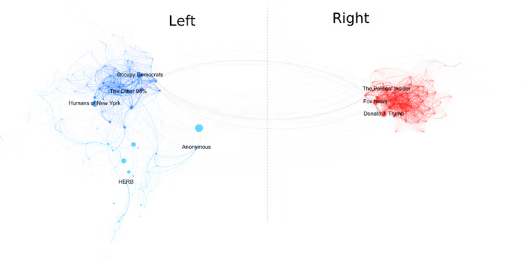
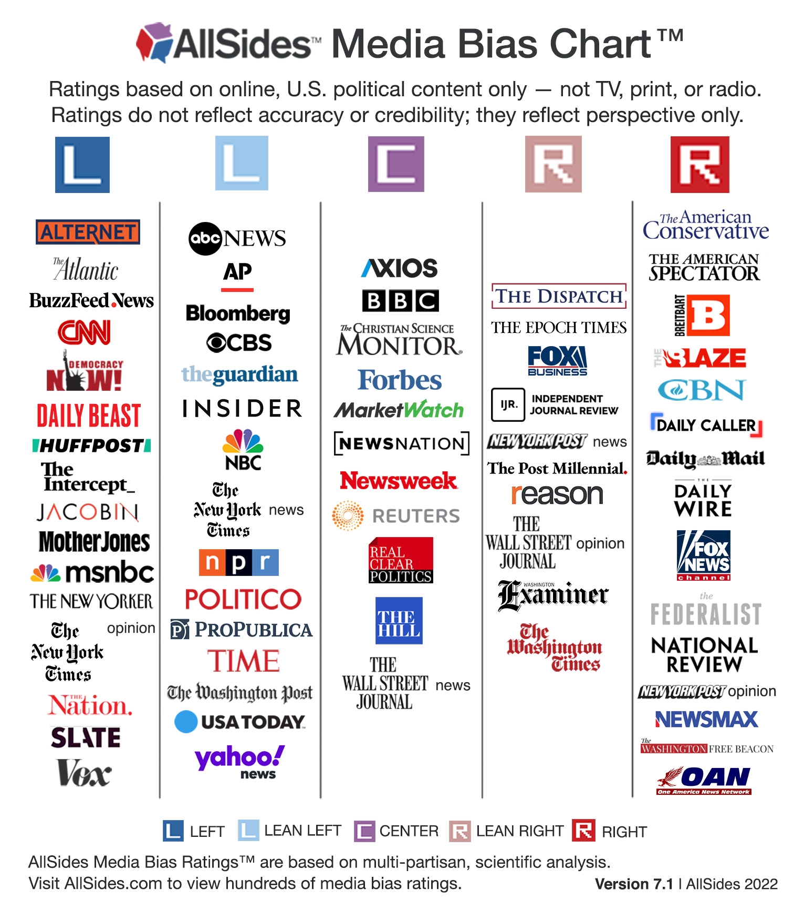
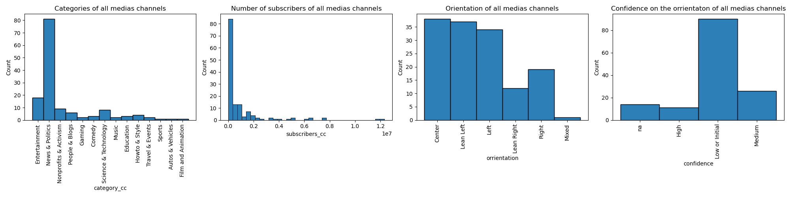

# Does Youtube reflects the overall polarization in the US?
Study of the links between Youtube channel communities thanks to the comments left by users

By the Adamantium Forgers

| Name                | Email                       |
|---------------------|-----------------------------|
| Loïc Fischer        | loic.fischer@epfl.ch        |
| Stéphane Weissbaum  | stephane.weissbaum@epfl.ch  |
| Camille Bernelin    | camille.bernelin@epfl.ch    |
| Michel Morales      | michel.morales@epfl.ch      |

Project based on the YouNiverse dataset provided by the EPFL dlab ([Github](https://github.com/epfl-dlab/YouNiverse) and [Dataset](https://zenodo.org/record/4650046#.Y3bCAzOZNpg))

## Abstract
In 2017, with the arrival in power of Donald Trump as president of the United States, the American political world then quickly split between the pro and anti Trump. This polarization is also reflected online: according to a [study][2] on Facebook lead by to brazilan reseacher, the polarization one year after the the 2017 election can be pictures as follows

*One year after the bitterly divisive election of Donald Trump as U.S. president, American Facebook users on the political right shared virtually no interests with those on the political left. Pablo Ortellado and Marcio Moretto Ribeiro, CC BY*

However this trend of a more polarized society goes back even further. According to a [study][1] lead by Jesse M. Shapiro, Brown University, this polarization began in the late 1990s and early 2000s and has been only increasing since, promoted by the detrimental properties of the US voting system that incentivize people to become radical.

Does the same effect can be measure on youtube communities? The goal of this data story would be to analyse the differents ineraction between the communites on youtube. Does they share a common interest?

## Research Questions
In this project, we will try to answer the following questions, as many as possible by order of priority, in accordance to the time available before the milestone 3:
1. Can we identify communities inside the already classified 56 main US News&Politics channels ? Is there a clear left-right polarization and isolated communities on each side?
2. Can we identify natural communities in the whole dataset, independently of the political orientation?
3. What is the distribution of users polarization? Is it Gaussian? How many very extreme users do we see? For this purpose, we could assign a p-score (polarization or political score) to users : -1 for left, -0.5 for lean left, 0 for center, 0.5 for lean right, 1 for right.
4. Study a few particular «neutral» channels (ex : NASA, MIT, KhanAcademy, ...) or marginal channels (Flat Earth Society) and analyze their audience, thanks to the classified news channels. What percentage of their audience do they share with each political orientation?
5. Study various vents by filtering by tags, descriptions or video titles that contains key words, for example "US Election", "Impeachment", "Hunter Biden", "Capitol". Are these events more covered by one political side?

## Additional dataset 

In order to classify the different political orientations of the youtube users, we decided to use the media bias classification given by [Allsides][3].

AllSides is an American company that assesses the political bias of prominent media outlets, categorized in five political orientation categories. More info [here][5].

*US media bias classification* 

The website has been scraped and 2 data sets have been created:
- A dataset with only the featured media (59 medias)
- A dataset with all the media identified on the website (1279 medias)

5 kind of datea have beeen extracted from the website:
- the name of the media
- the media bias given by [Allsides][3]
- the confidence of [Allsides][3] on the media bias
- the number of vote of the community that agree with the media bias
- the number of vote of the community that disagree with the media bias

|        |**name**|**orrientation**|**confidence**|**commu_agree**|**commu_disagree**|
|--------|------------------------|------------|----------|---------|------------|
| **0**  | ABC News               | Lean Left  | High     | 39305   | 19628      |
| **...**| ...                    | ...        | ...      | ...     | ...        |

Once the dataset cleaned and merged with the youtube channels, 37 on 59 channels were found in the youniverse dataset.

||**category_cc**|**join_date**|**channel**|**name_cc**|**subscribers_cc**|**videos_cc**|**subscriber_rank_sb**|**weights**|**orrientation**|**confidence**|**comu_agree**|**comu_disagree**|
|--|---|---|----|-----|----|----|----|----|----|----|------|---|
|**0**|News&Politics|2006-08-07|UCBi2mrWuNuyYy4gbM6fU18Q|abcnews|6640000|48869|978.0|2.087|LeanLeft|High|39419|19665|
|**...**|...|...|...|...|...|...|...|...|...|...|...|...|27222|

To get a first idea of t data, the visualisation of the two new datasets can be found in the file: *news_channel.ipynb*

### For the bigger dataset:

### For the featured medias:

## Methodology
ADD LIST OF OUR USEFUL FILES
- channels.csv : relates channel_id to channel_num (all channels in News&Politics)
- medias.csv : relates channel_id, channel name and channel_num, for AllTimes medias
- display_id to channels.csv : connects, for all News&Politics channels, display_id to channels_num
- authors_to_channels.csv : for all News&Politics channels, 1 line : this author has comented (at least once) this channel (identified by channel_num)
- graph.csv : all graph edges, connecting two channels that have been commented by the same authors. Weight : number of authors who commented both channels
- graph_test.csv : short version of graph.csv, to perform tests with Gephi

### Data handling
Since this dataset is huge (~111GB compressed), it is very important to have a proper methodology to store, access, preprocess and filter it efficiently.

Storage on external hard drive

Access by chunks

Explain in detail what we filtered
Give mathematical details of the methods used (and libraries)

### Step 1: 

### Step 2: Clustering

### Step 3: Visualization using the Gephi software

INSERT HERE OUR FIRST GRAPHS

The diffenrent community would be created using the file "youtube_comments". Every user who commented on one of the diffenrent news souces would be assign to a plotical orrientation.

Then a graph linking channels with the nummber of user commenting the two channels as a link would be created. Finally the goal would be to cluster the different channels an alanyse if 

## Proposed timeline
- 18 November: Milestone P2 due
- 25 November: Filter the dataset (eliminate indian channels) and try to answer research questions 1 and 2.
- 02 November: Homework 2 due. No project work
- 09 December: Creation of the website to have an idea (even if empty for the moment)
- 16 December: ???
- 23 December: Milestone P3 due. Focus on writing up the report or the data story, preparing the final presentation, formating for the website and the data story, 

## Team organization

- Loïc:
- Camille: 
- Michel : 
- Stéphane: 

[1]: https://www.nber.org/papers/w26669
[2]: https://theconversation.com/mapping-brazils-political-polarization-online-96434
[3]: https://www.allsides.com/media-bias
[4]: https://www.allsides.com
[5]: https://en.wikipedia.org/wiki/AllSides
