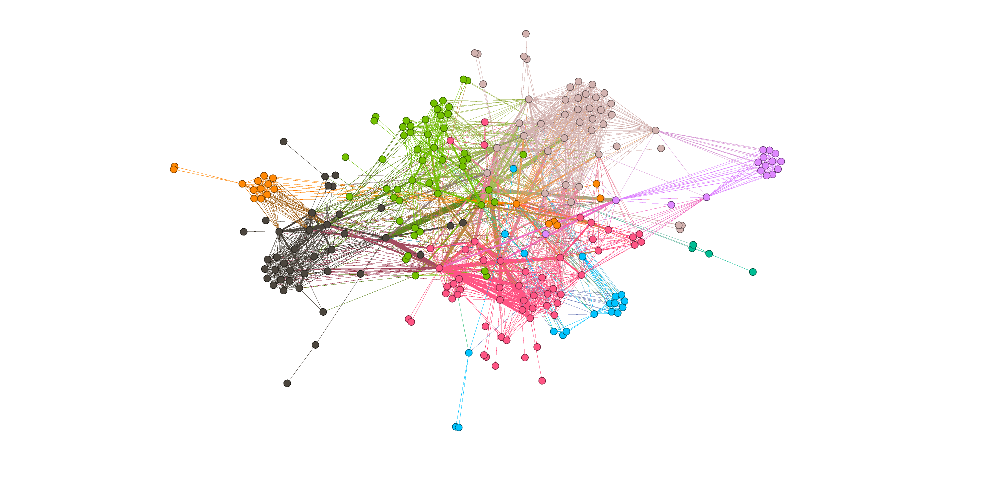

# Does Youtube reflect the overall political polarization in the US?

By the Adamantium Forgers:

| Name                | Email                       |
|---------------------|-----------------------------|
| Loïc Fischer        | loic.fischer@epfl.ch        |
| Stéphane Weissbaum  | stephane.weissbaum@epfl.ch  |
| Camille Bernelin    | camille.bernelin@epfl.ch    |
| Michel Morales      | michel.morales@epfl.ch      |

## Organization

Here is the link to our [Data story](https://sw-e.github.io/ADAmantiumForgers/)

Here are listed the main files that make up the project.
Python files are used to create the data and export the results to csv files. These are more practical to use with git as for version control and code merge. Most of the time, no output is generated in python files and no proper visualization is done, reason why these long files were not converted into jupyter notebooks. Then, we tried to do all processing and visualization in compact jupyter notebooks.

Jupyter Notebooks:
* [graph_construction.ipynb](graph_construction.ipynb) : Build the graph from YouNiverse data
* [p-score.ipynb](p-score.ipynb) : Compute the p-score from the comments and plot the distribution of p-scores
* [clustering.ipynb](clustering.ipynb) : Filters the unwanted news & politics channels and creates finds communities withing the clean channels 
* [large_clustering.ipynb](large_clustering.ipynb) : Idem but on the much larger graph from a larger subset of comments.
* [titles_analysis.ipynb](titles_analysis.ipynb) : Run the NLP analysis of videos titles, analyses distance to other datasets, analyses occurences of given words ensembles.
* [untitled] Loic?

## Abstract
In 2017, with the arrival in power of Donald Trump as president of the United States, the American political world quickly split between the pro and anti-Trump. According to a [study][1] lead by Jesse M. Shapiro, Brown University, this polarization began in the late 1990s and early 2000s and has been only increasing since, promoted by the detrimental properties of the US voting system that incentivize people to become radical. This polarization is also reflected online: according to a [study][2] on Facebook lead by to Brazilian researcher, the polarization one year after the 2017 election can be pictured on the figure below. Can the same effect be measured on YouTube communities ? In this data story, we will analyze the profiles of political communities on YouTube.

## Research Questions
We tried to answer the following questions:
1. Can we identify communities inside the main US News&Politics channels ? Is there a clear left-right polarization or is the polarization independent of classical political party confrontation ?
2. What is the distribution of users polarization? Is it Gaussian? How many very extreme users do we see? For this purpose, we assigned a p-score (polarization or political score) to users.
3. How are main political events treated by channels in different communities ? We studied various events by filtering by tags, descriptions or video titles that contain key words.

## Additional dataset 

### AllSides

In order to classify the different political orientations of the youtube users, we decided to use the media bias classification given by [Allsides][3]. AllSides is an American company that assesses the political bias of prominent media outlets, categorized in five political orientation categories: Left, Lean Left, Center, Lean Right, Right. More info [here][5]. The code used to extract the AllSides dataset is in the [allsides_scraping.py](./allsides_scraping/allsides_scraping.py) file. No notebook was produced since no output is required, only an export to csv.

*US media bias classification* 

The website has been scraped and 2 data sets have been created:
- A dataset with only the featured media (59 medias)
- A dataset with all the media identified on the website (1279 medias)

5 kind of data have beeen extracted from the website regarding the medias:
- name
- political bias given by [Allsides][3]
- confidence level on bias of [Allsides][3]
- number of community votes confirming the media bias
- number of community votes disproving the media bias

### Data collected from Allsides:
|        |**name**|**orrientation**|**confidence**|**commu_agree**|**commu_disagree**|
|--------|------------------------|------------|----------|---------|------------|
| **0**  | ABC News               | Lean Left  | High     | 39305   | 19628      |
| **...**| ...                    | ...        | ...      | ...     | ...        |

Once the dataset cleaned, 37 on 59 medias have associated channels in the youniverse dataset. Those csv files, [*channels_yt_all.csv*](./allsides_scraping/csv/channels_yt_all.csv) and [*channels_yt_ft.csv*](./allsides_scraping/csv/channels_yt_ft.csv), can be found [here](./allsides_scraping/csv).

### Merged data with the Youniverse dataset:
||**category_cc**|**join_date**|**channel**|**name_cc**|**subscribers_cc**|**videos_cc**|**subscriber_rank_sb**|**weights**|**orrientation**|**confidence**|**comu_agree**|**comu_disagree**|
|--|---|---|----|-----|----|----|----|----|----|----|------|---|
|**0**|News&Politics|2006-08-07|UCBi2mrWuNuyYy4gbM6fU18Q|abcnews|6640000|48869|978.0|2.087|LeanLeft|High|39419|19665|
|**...**|...|...|...|...|...|...|...|...|...|...|...|...|27222|

To get a first idea of the data, the visualization of the two new datasets can be found in the file [*news_channel.ipynb*](./allsides_scraping/news_channel.ipynb)

### Lexical fields datasets

- Rishabh Misra's [news categories dataset](https://www.kaggle.com/datasets/rmisra/news-category-dataset), classifying news from the HuffPost in different categories. We will be using the "Black voices" and "Queer voices" categories.
- The [LOCO dataset](https://www.researchgate.net/publication/355578021_LOCO_The_88-million-word_language_of_conspiracy_corpus), characterizing the conspiracy language

These datasets are treated in the [titles_analysis.ipynb](titles_analysis.ipynb) file.

## Methods

The code used to treat raw data and create the original graph can be found in [graph_construction.ipynb](graph_construction.ipynb).
Then, [clustering.ipynb](clustering.ipynb) is used to identify communities in the graph.

Generated csv files (in `csv_output` folder) :
- channels.csv : relates channel_id to channel_num (all channels in News&Politics)
- medias.csv : relates channel_id, channel name and channel_num, for AllSides medias
- display_id_to_channels.csv : connects, for all News&Politics channels, display_id to channels_num
- authors_to_channels.csv : for all News&Politics channels, 1 line : this author has comented (at least once) this channel (identified by channel_num)
- graph_medias.csv: all graph edges, connecting two channels of AllTimes medias that have been commented by the same authors. Weight : number of authors who commented both channels
- graph_channels.csv: all graph edges, connecting two channels of News&Politics that have been commented by the same authors. Weight : number of authors who commented both channels
- louvain_filtered_graph.csv: same as graph_channels, but with non-english channels filtered out. 

### Data handling
Since this dataset is huge (~111GB compressed), it is very important to have a proper methodology to store, access, preprocess and filter it efficiently. All the data is stored locally, with the largest files on an external hard drive. The largest files are read by chunks to produce the graph. However, once the graph is done, the amount of data is much smaller (~30KB) and can be handled very easily.

### Clustering
We wanted to see if we were able to detect channel communities within our dataset. To do this we generated an undirected weigthed graph using user comments with the following methodology : If a user wrote a comment on a video of channel 1 and a comment on a video on channel 2, we create an edge of weight 1 between channel 1 and channel 2. To rapidly visualize how well it works we used `Gephi`, an open source graph visualisation platform. We discovered the louvain algorithm on gephi and realised it detected communities quite well. There were a lot of news channel that were pakistani or indian. When we ran the louvain algorithm with python using the `networkx` package, we quickly identified all the channels that were unnecessary. We then obtained a list of channels that were only in the USA and in the correct language. We ran the louvain algorithm again on our new filtered graph and obtained promising results. We indeed discovered discovered left and right-oriented communities 

## Contributions

- Loïc: 
    - Overview and global analysis
    - Creation of the AllSides dataset and scraping
    - Identfication of the communities by cross reference with AllSides channels
    - Writing of the data story

- Camille: 
    - Creation of the graph
    - Analysis of words occurences in video tags and titles
    - Comparison with external datasets for lexical fields analysis
    - Writing of the data story

- Michel : Implement properly the clustering algorithms, colorize the graph as function of the communities

- Stéphane: 
    - Long data processing: creation of the graph on a much larger number of comments (17h of runtime).
    - Implementation of the p-score to analyze the distribution of users (run on the whole dataset)
    - Creation of the data story website, visual design and illustration with self created images
    - Writing of the data story

[1]: https://www.nber.org/papers/w26669
[2]: https://theconversation.com/mapping-brazils-political-polarization-online-96434
[3]: https://www.allsides.com/media-bias
[4]: https://www.allsides.com
[5]: https://en.wikipedia.org/wiki/AllSides
