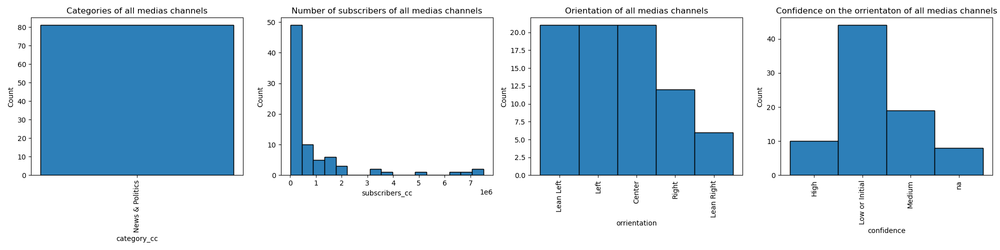

# Does Youtube reflects the overall polarization in the US?
Study of the links between Youtube channel communities thanks to the comments left by users

By the Adamantium Forgers

| Name                | Email                       |
|---------------------|-----------------------------|
| Loïc Fischer        | loic.fischer@epfl.ch        |
| Stéphane Weissbaum  | stephane.weissbaum@epfl.ch  |
| Camille Bernelin    | camille.bernelin@epfl.ch    |
| Michel Morales      | michel.morales@epfl.ch      |

Project based on the YouNiverse dataset provided by the EPFL dlab ([Github](https://github.com/epfl-dlab/YouNiverse) and [Dataset](https://zenodo.org/record/4650046#.Y3bCAzOZNpg))

## Abstract
In 2017, with the arrival in power of Donald Trump as president of the United States, the American political world then quickly split between the pro and anti-Trump. This polarization is also reflected online: according to a [study][2] on Facebook lead by to Brazilian researcher, the polarization one year after the 2017 election can be pictures as follows :

*Complete disconnexion of political landscape. Pablo Ortellado and Marcio Moretto Ribeiro, CC BY*

According to a [study][1] lead by Jesse M. Shapiro, Brown University, this polarization began in the late 1990s and early 2000s and has been only increasing since, promoted by the detrimental properties of the US voting system that incentivize people to become radical.

Can the same effect be measured on YouTube communities ? In this data story, we will analyze the profiles of political communities on YouTube.

## Research Questions
In this project, we will try to answer the following questions, as many as possible by order of priority, in accordance to the time available before the milestone 3:
1. Can we identify communities inside the main US News&Politics channels ? Is there a clear left-right polarization and isolated communities on each side?
2. Can we identify natural communities in the whole dataset, independently of the political orientation?
3. What is the distribution of users polarization? Is it Gaussian? How many very extreme users do we see? For this purpose, we will assign a p-score (polarization or political score) to users.
4. Based on the communities identified, can we describe political orientation of audience of non-News&Politics channels ? Study a few particular «neutral» channels (ex : NASA, KhanAcademy, Gaming channels, Comedy Channels ...) or marginal channels (Flat Earth Society) and analyze their audience and their links with news channels.
5. How are main political events treated by channels in different communities ? Study various vents by filtering by tags, descriptions or video titles that contains key words, for example "US Election", "Impeachment", "Hunter Biden", "Capitol".

## Additional dataset 

In order to classify the different political orientations of the youtube users, we decided to use the media bias classification given by [Allsides][3].

AllSides is an American company that assesses the political bias of prominent media outlets, categorized in five political orientation categories. More info [here][5].

*US media bias classification* 

The website has been scraped and 2 data sets have been created:
- A dataset with only the featured media (59 medias)
- A dataset with all the media identified on the website (1279 medias)

5 kind of data have beeen extracted from the website regarding the medias:
- name
- political bias given by [Allsides][3]
- confidence level on bias of [Allsides][3]
- number of community votes confirming the media bias
- number of community votes disproving the media bias

### Data collected from Allsides:
|        |**name**|**orrientation**|**confidence**|**commu_agree**|**commu_disagree**|
|--------|------------------------|------------|----------|---------|------------|
| **0**  | ABC News               | Lean Left  | High     | 39305   | 19628      |
| **...**| ...                    | ...        | ...      | ...     | ...        |

Once the dataset cleaned, 37 on 59 medias have associated channels in the youniverse dataset. Those csv files, [*channels_yt_all.csv*](./allsides_scraping/csv/channels_yt_all.csv) and [*channels_yt_ft.csv*](./allsides_scraping/csv/channels_yt_ft.csv), can be found [here](./allsides_scraping/csv).

### Merged data with the Youniverse dataset:
||**category_cc**|**join_date**|**channel**|**name_cc**|**subscribers_cc**|**videos_cc**|**subscriber_rank_sb**|**weights**|**orrientation**|**confidence**|**comu_agree**|**comu_disagree**|
|--|---|---|----|-----|----|----|----|----|----|----|------|---|
|**0**|News&Politics|2006-08-07|UCBi2mrWuNuyYy4gbM6fU18Q|abcnews|6640000|48869|978.0|2.087|LeanLeft|High|39419|19665|
|**...**|...|...|...|...|...|...|...|...|...|...|...|...|27222|

To get a first idea of t data, the visualisation of the two new datasets can be found in the file: *news_channel.ipynb* under allsides_scraping

### For the bigger dataset:

### For the featured medias:

## Methods

The code used to exctract the AllSides dataset is in allsides_scraping file.
The code used to treat raw data and create the original graph can be found in graph_creation.ipynb.
Then, clustering.ipynb is used to identify communities in the graph.

Generated csv files (in csv_output file) :
- channels.csv : relates channel_id to channel_num (all channels in News&Politics)
- medias.csv : relates channel_id, channel name and channel_num, for AllTimes medias
- display_id_to_channels.csv : connects, for all News&Politics channels, display_id to channels_num
- authors_to_channels.csv : for all News&Politics channels, 1 line : this author has comented (at least once) this channel (identified by channel_num)
- graph.csv : all graph edges, connecting two channels that have been commented by the same authors. Weight : number of authors who commented both channels
- graph_test.csv : short version of graph.csv, to perform tests with Gephi

### Data handling
Since this dataset is huge (~111GB compressed), it is very important to have a proper methodology to store, access, preprocess and filter it efficiently.

Storage on external hard drive

Access by chunks

Explain in detail what we filtered
Give mathematical details of the methods used (and libraries)

### Create a sample of data to work on

### Clustering

We wanted to see if we were able to detect channel communities within our dataset. To do this we generated an undirected weigthed graph using user comments with the following methodology : If a user wrote a comment on a video of channel 1 and a comment on a video on channel 2, we create an edge of weight 1 between channel 1 and channel 2.

To rapidly visualize how well it works we used `Gephi`, an open source graph visualisation platform. We discovered the louvain algorithm on gephi and realised it detected communities quite well.

There were a lot of news channel that were pakistani or indian. When we ran the louvain algorithm with python using the `networkx` package, we quickly identified all the channels that were unnecessary. We then obtained a list of channels that were only in the USA and in the correct language.

We ran the louvain algorithm again on our new filtered graph and obtained promising results. We indeed discovered discovered left and right-oriented communities 

### Visualization

## Proposed timeline
- 18 November: Milestone P2 due
- 25 November: Apply everything we tested yet (Louvain algorithm, graph visualisation) to the whole/larger subset of comments
- 02 December: Homework 2 due. No project work
- 09 December: Creation of the website to have an idea (even if empty for the moment), look into words occurences analysis of video titles and tags, give political score to authors
- 16 December: Answer research questions
- 23 December: Milestone P3 due. Focus on writing up the report or the data story, preparing the final presentation, formating for the website and the data story, 

## Team organization

- Loïc:
- Camille: Answer research question 5
- Michel : 
- Stéphane: 

[1]: https://www.nber.org/papers/w26669
[2]: https://theconversation.com/mapping-brazils-political-polarization-online-96434
[3]: https://www.allsides.com/media-bias
[4]: https://www.allsides.com
[5]: https://en.wikipedia.org/wiki/AllSides
